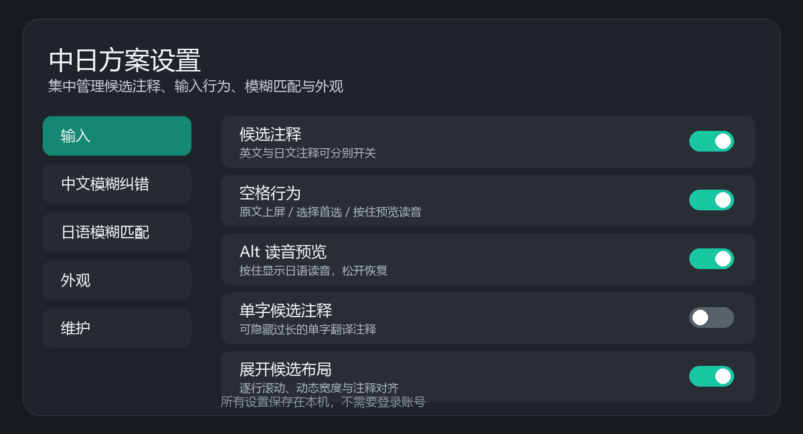

# Rime 中日直输 1.1

[简体中文](./README.md) | [English](./README_EN.md)

基于小狼毫（Weasel）与雾凇拼音的 Windows 中日混输输入法。中文拼音和日语罗马字可以直接混输，无需日语前缀。

> 演示动画由公开示例词合成，不是桌面截图，不包含账号、文件名、个人词库或真实输入记录。

## 项目特点

- **无需切换模式**：中文拼音与日语罗马字在同一个方案中直接输入
- **三语候选信息**：中文候选可显示简短英文释义、自然日语翻译与日语读音
- **面向真实输入习惯**：支持日语长音、促音、浊音及可配置的中日模糊匹配
- **完整桌面体验**：修改版候选窗、图形化设置面板和 Windows 一键安装器
- **本地优先**：输入与候选计算完全离线，不上传输入内容或个人输入习惯

## 下载与安装

请从 [GitHub Releases](https://github.com/swiftol/Rime_Config/releases/latest) 下载最新版 **1.1 一键安装 EXE**。

安装包包含完整的中文、日语及翻译注释词库，安装后即可使用，不需要另外配置词库。安装程序会为 Windows 的实际登录用户部署配置，不会只写入管理员账户。

如果电脑已经安装本项目旧版本，安装器会先备份现有配置并保留个人数据，再升级运行组件、重新部署并启动输入法服务。安装后无需重启 Windows；已经打开的记事本、浏览器等应用需要关闭并重新打开，以加载新版输入法组件。

项目完全离线运行，不上传输入内容或个人输入习惯。

## 主要功能

- 中文拼音与日语罗马字直接混输
- 中文候选附带英文、日文翻译注释，且可分别开关
- 日语促音、长音、浊音及多组罗马字模糊匹配
- 微信输入法风格的展开候选窗与逐行翻页
- 候选文字、底色、宽度及生僻字过滤设置
- 图形化“中日方案设置”面板
- 自定义中文、日语模糊匹配规则
- Shift、空格或 Alt 按住预览日语读音
- 空格、回车、候选注释布局等输入行为可配置

## 图形化设置

安装后可从开始菜单或桌面打开“中日方案设置”。

设置面板可修改翻译注释、日语模糊匹配、中文模糊纠错、候选外观、生僻字过滤和空格键行为。修改后点击“应用设置”；需要重新编译词库的设置会自动重新部署。

## 隐私

输入法在本机离线运行，不需要登录账号，也不会上传输入文本、选词记录或个人输入习惯。项目发布包只提供软件运行所需的公共配置与词库。

详细的数据边界和公开图片规则见 [隐私说明](./docs/PRIVACY.md)。

## 版本与更新

- 最新稳定版：[Rime 中日直输 1.1.0](https://github.com/swiftol/Rime_Config/releases/latest)
- 历史安装包：[全部 Releases](https://github.com/swiftol/Rime_Config/releases)
- 详细改动：[CHANGELOG.md](./CHANGELOG.md)

## 测试与质量保证

项目同时进行配置/词典检查、独立引擎候选测试和 Windows 原生 TSF 输入测试。发布前还会验证干净安装、历史版本升级、个人数据保留、冷启动日语长音和新宿主进程实际加载的输入法组件。

- [公开测试规范](./docs/TESTING.md)
- [项目架构](./docs/ARCHITECTURE.md)
- [发布与打包检查清单](./installer/RELEASE-PACKAGING-CHECKLIST.md)
- [参与贡献](./CONTRIBUTING.md)

## 源码目录

- Rime 配置和词库：仓库根目录
- 图形化设置面板：[`src/RimeSettings`](./src/RimeSettings)
- 一键安装器：[`installer`](./installer)
- 修改版小狼毫界面：[swiftol/weasel](https://github.com/swiftol/weasel)
- 修改版 librime：[swiftol/librime](https://github.com/swiftol/librime)

## 致谢与许可

本项目基于 [雾凇拼音](https://github.com/iDvel/rime-ice)、[rime-japanese](https://github.com/gkovacs/rime-japanese)， [Rime](https://rime.im/) 和 [小狼毫](https://github.com/rime/weasel) 开发。各部分遵循其目录中注明的原始许可证；二次修改部分按仓库许可证发布。
