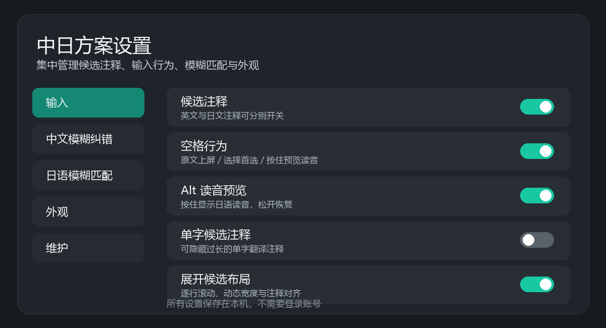

# Rime 中日直输

[简体中文](./README.md) | [English](./README_EN.md)

基于小狼毫（Weasel）、雾凇拼音与 Rime 的 Windows 中日混输输入法。中文拼音和日语罗马字可以直接混输，无需日语前缀；同时提供独立的日语 Mozc 方案。

> 演示动画由公开示例词合成，不是桌面截图，不包含账号、文件名、个人词库或真实输入记录。

## 项目特点

- **中日混合输入**：中文拼音与日语罗马字无需切换模式；也可选用独立的 Mozc 日语方案
- **日语候选与拼接**：日语罗马字分段、词典候选、前缀续接、保留字和可配置的 AZIK/模糊规则
- **本地与云端候选**：本地候选即时显示；可选启用 Google 云候选，并选择中文、日语或两种语言
- **丰富注释**：候选可显示英文释义、日语翻译和读音；可控制注释来源与显示方式
- **完整桌面体验**：修改版候选窗、图形化设置面板、词频/短语管理和 Windows 安装器
- **本地优先、联网可选**：日常本地输入不依赖网络；启用云候选或主动使用在线翻译时，相关输入文本会发送给对应服务处理

## 下载与安装

请从 [GitHub Releases](https://github.com/swiftol/Rime_Config/releases/latest) 下载 Windows 安装包。源码持续更新于 [`master`](https://github.com/swiftol/Rime_Config/tree/master)；安装包版本与源码分支提交分别管理，请以 Release 说明中的构建提交为准。

安装包包含完整的中文、日语及翻译注释词库，安装后即可使用，不需要另外配置词库。安装程序会为 Windows 的实际登录用户部署配置，不会只写入管理员账户。

如果电脑已经安装本项目旧版本，安装器会先备份现有配置并保留个人数据，再升级运行组件、重新部署并启动输入法服务。安装后无需重启 Windows；已经打开的记事本、浏览器等应用需要关闭并重新打开，以加载新版输入法组件。

本地候选、词频和个人学习数据均在本机处理。云候选默认关闭；开启后，输入中的拼写会发送给 Google Input Tools 获取候选。在线句子翻译由用户主动触发，并使用用户自行配置的小牛翻译凭据。云服务的具体数据边界见[隐私说明](./docs/PRIVACY.md)。

## 主要功能

- 中文拼音与日语罗马字混输，以及独立 Mozc 日语输入方案
- AZIK 扩展、日语假名输入表、长音/促音处理、模糊匹配和候选拼接
- 日语保留字分组管理：启用、分类、添加、编辑和删除
- 云候选支持中/日/双语模式、语言自动判断、重复合并和本地学习
- 中文候选的英文/日文翻译注释、日语读音及注释来源选择
- 可滚动展开候选窗、按视觉行翻页、候选注释和云标记
- 候选外观、数字键选择边界、读音预览和输入行为设置
- 图形化设置面板、用户词典管理与个人数据迁移

## 图形化设置

安装后可从开始菜单或桌面打开“中日方案设置”。

设置面板可管理输入方案、云候选语言、翻译注释、日语模糊匹配与保留字、候选外观、按键行为和个人词典。修改后点击“应用设置”；需要重新编译词库的设置会自动重新部署。

## 隐私

输入法在本机离线运行，不需要登录账号，也不会上传输入文本、选词记录或个人输入习惯。项目发布包只提供软件运行所需的公共配置与词库。

详细的数据边界和公开图片规则见 [隐私说明](./docs/PRIVACY.md)。

## 版本与更新

- 最新安装包：[GitHub Releases](https://github.com/swiftol/Rime_Config/releases/latest)
- 最新源码：[master 分支](https://github.com/swiftol/Rime_Config/tree/master)
- 历史安装包：[全部 Releases](https://github.com/swiftol/Rime_Config/releases)
- 详细改动：[CHANGELOG.md](./CHANGELOG.md)

## 测试与质量保证

项目同时进行配置/词典检查、独立引擎候选测试和 Windows 原生 TSF 输入测试。发布前还会验证干净安装、历史版本升级、个人数据保留、冷启动日语长音和新宿主进程实际加载的输入法组件。

- [公开测试规范](./docs/TESTING.md)
- [项目架构](./docs/ARCHITECTURE.md)
- [发布与打包检查清单](./installer/RELEASE-PACKAGING-CHECKLIST.md)
- [参与贡献](./CONTRIBUTING.md)

## 源码目录

- Rime 配置和词库：仓库根目录
- 图形化设置面板：[`src/RimeSettings`](./src/RimeSettings)
- 一键安装器：[`installer`](./installer)
- 修改版小狼毫界面：[swiftol/weasel](https://github.com/swiftol/weasel)
- 修改版 librime：[swiftol/librime](https://github.com/swiftol/librime)

## 致谢与许可

本项目大量依托开源输入法生态，也参考了其他项目的设计经验。为避免混淆，下面区分“直接依赖/沿用”与“算法或产品思路参考”；参考思路不代表复制其代码。

| 项目或服务 | 在本项目中的用途与致谢 | 关系 |
| --- | --- | --- |
| [Rime](https://github.com/rime)、[小狼毫 Weasel](https://github.com/rime/weasel) | 输入法引擎与 Windows 前端基础 | 上游组件；改动版本见 [swiftol/librime](https://github.com/swiftol/librime) 与 [swiftol/weasel](https://github.com/swiftol/weasel) |
| [雾凇拼音](https://github.com/iDvel/rime-ice) | 中文方案、词库与配置基础 | 直接基于并持续修改；保留上游版权与许可证要求 |
| [rime-japanese](https://github.com/gkovacs/rime-japanese) | 日语方案与词典生态参考 | 上游参考，依各文件标注保留许可 |
| [水杉输入法（Metasequoia）](https://github.com/metasequoiaime/msime-windows) | 日语输入的分段、上下文续接、候选组织与选择行为研究 | 算法/交互思路参考；本仓库的 Rime/Lua 实现为本项目代码，不是水杉源码移植 |
| [Mozc](https://github.com/google/mozc) | 独立日语方案的转换引擎与公开词典数据 | 随包携带所需运行文件；版权和再分发文本在 [`mozc-runtime/licenses`](./mozc-runtime/licenses) |
| [Google Input Tools](https://www.google.com/inputtools/) | 可选的中文/日语云候选来源 | 在线服务，不是本仓库代码；启用后会发送当前拼写以获取建议 |
| [小牛翻译 API](https://niutrans.com/) | 设置面板中用户主动触发的在线句子翻译 | 外部在线服务；用户自行配置凭据，翻译文本会发送至该服务 |

本项目的云候选队列、双语判定、候选去重/排序、缓存与个人学习逻辑由本项目实现；没有把“水杉”或 Google 的闭源输入法源码复制进来。各第三方组件和数据分别遵循其上游许可证；本项目自有部分按仓库 [GPL-3.0](./LICENSE) 发布。完整数据边界见[隐私说明](./docs/PRIVACY.md)。
