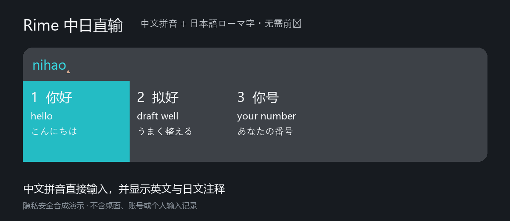

# Rime Chinese–Japanese Direct Input 1.1

[简体中文](./README.md) | **English**

Rime Chinese–Japanese Direct Input is a Windows IME distribution built on Weasel and Rime Ice. It accepts Chinese Pinyin and Japanese romaji in one schema, without a Japanese-only prefix or a manual mode switch.

> The animation is generated from public sample words. It contains no desktop capture, account information, personal vocabulary, or user input history.

## Highlights

- **One mixed schema** — type Chinese Pinyin and Japanese romaji directly.
- **Trilingual candidate information** — Chinese candidates may show concise English definitions, natural Japanese translations, and Japanese readings.
- **Practical Japanese input** — long vowels, sokuon, voiced sounds, spelling variants, and configurable fuzzy rules.
- **Custom candidate UI** — compact single-row mode, scrollable expanded mode, dynamic widths, annotation alignment, and separate Chinese/Japanese colors.
- **GUI settings** — configure annotations, key behavior, fuzzy matching, appearance, common phrases, and rare-character filtering.
- **Windows installer** — install or upgrade while preserving personal data; Windows itself does not need to restart.
- **Local-first privacy** — input processing stays on the device. No account or cloud service is required.

## Download

Download the latest Windows installer from [GitHub Releases](https://github.com/swiftol/Rime_Config/releases/latest).

The installer includes the runtime, public dictionaries, translation annotations, and the settings application. After an upgrade, close and reopen already-running applications so that they load the new IME component.

## Privacy

The IME does not upload typed text, candidate selections, personal phrases, clipboard history, synchronization data, logs, or device identifiers. Release packages contain only the public runtime, configuration, and dictionaries required by the product.

See [Privacy](./docs/PRIVACY.md) for the public data boundary.

## Repository map

- Rime schemas and dictionaries: repository root, `cn_dicts`, `dicts`, `en_dicts`
- GUI settings application: [`src/RimeSettings`](./src/RimeSettings)
- Windows installer: [`installer`](./installer)
- Lua extensions: [`lua`](./lua)
- Modified Weasel UI: [swiftol/weasel](https://github.com/swiftol/weasel)
- Modified librime: [swiftol/librime](https://github.com/swiftol/librime)

See [Architecture](./docs/ARCHITECTURE.md) for how the Windows TSF frontend, Rime engine, Lua candidate pipeline, dictionaries, settings application, and installer fit together.

## Quality and testing

Changes are checked with dictionary/config validation, an independent engine candidate test, and a real Windows TSF input-host test. The release checklist also verifies clean installation, upgrade behavior, personal-data preservation, cold-start Japanese long vowels, and candidate-window loading in newly opened applications.

See [Testing and release verification](./docs/TESTING.md).

## Contributing

Issues and reproducible input examples are welcome. Please read [CONTRIBUTING.md](./CONTRIBUTING.md) before submitting a change.

## Credits and license

This project builds on [Rime Ice](https://github.com/iDvel/rime-ice), [rime-japanese](https://github.com/gkovacs/rime-japanese), [Rime](https://rime.im/), and [Weasel](https://github.com/rime/weasel). Upstream components retain their original licenses; project modifications follow the license declared in this repository.
