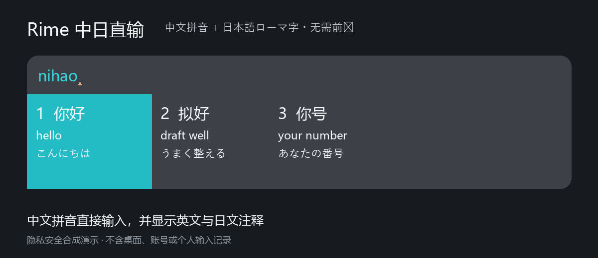

# Rime Chinese–Japanese Direct Input

[简体中文](./README.md) | **English**

Rime Chinese–Japanese Direct Input is a Windows IME distribution built on Weasel, Rime Ice, and Rime. It accepts Chinese Pinyin and Japanese romaji in one schema, and also includes a separate Mozc-based Japanese schema.

> The animation is generated from public sample words. It contains no desktop capture, account information, personal vocabulary, or user input history.

## Highlights

- **Mixed Chinese and Japanese input** — type Pinyin and Japanese romaji without switching modes; an independent Mozc scheme is also available.
- **Japanese composition** — AZIK extensions, kana input table, long-vowel and sokuon handling, fuzzy matching, and contextual candidate continuation.
- **Optional cloud candidates** — Google suggestions can be configured for Chinese, Japanese, or both languages; local candidates appear independently.
- **Candidate annotations** — English/Japanese translations and Japanese readings, with controls for annotation source and display.
- **Japanese reserved words** — organize, add, edit, remove, and enable groups of composable entries.
- **Desktop experience** — scrollable candidate window, row-based paging, GUI settings, dictionary management, and personal-data migration.
- **Local-first, network optional** — ordinary local input works offline; enabling cloud suggestions or explicitly requesting online translation sends relevant text to the selected service.

## Download

Download the latest Windows installer from [GitHub Releases](https://github.com/swiftol/Rime_Config/releases/latest). Source changes are published on [`master`](https://github.com/swiftol/Rime_Config/tree/master); check each Release for the source commit corresponding to its installer.

The installer includes the runtime, public dictionaries, translation annotations, and the settings application. After an upgrade, close and reopen already-running applications so that they load the new IME component.

## Privacy

Local candidate generation and personal learning stay on device. Cloud suggestions are off by default; when enabled, the current spelling is sent to Google Input Tools. Online sentence translation is user-initiated and uses credentials configured by the user for NiuTrans. See [Privacy](./docs/PRIVACY.md) for details.

## Repository map

- Rime schemas and dictionaries: repository root, `cn_dicts`, `dicts`, `en_dicts`
- GUI settings application: [`src/RimeSettings`](./src/RimeSettings)
- Windows installer: [`installer`](./installer)
- Lua extensions: [`lua`](./lua)
- Modified Weasel UI: [swiftol/weasel](https://github.com/swiftol/weasel)
- Modified librime: [swiftol/librime](https://github.com/swiftol/librime)

See [Architecture](./docs/ARCHITECTURE.md) for how the Windows TSF frontend, Rime engine, Lua candidate pipeline, dictionaries, settings application, and installer fit together.

## Quality and testing

Changes are checked with dictionary/config validation, an independent engine candidate test, and a real Windows TSF input-host test. The release checklist also verifies clean installation, upgrade behavior, personal-data preservation, cold-start Japanese long vowels, and candidate-window loading in newly opened applications.

See [Testing and release verification](./docs/TESTING.md).

## Contributing

Issues and reproducible input examples are welcome. Please read [CONTRIBUTING.md](./CONTRIBUTING.md) before submitting a change.

## Credits and license

This project builds on [Rime](https://github.com/rime), [Weasel](https://github.com/rime/weasel), [Rime Ice](https://github.com/iDvel/rime-ice), and the [rime-japanese ecosystem](https://github.com/gkovacs/rime-japanese). We also refer to and adapt ideas from the open-source [Metasequoia (Mizuki) IME](https://github.com/metasequoiaime/msime-windows) (GPL-3.0), especially Japanese sentence decoding/segmentation, candidate search, and contextual continuation. The adapted Rime/Lua implementation is mainly in [`mozc_v2_translator.lua`](./lua/mozc_v2_translator.lua), [`mozc_candidate_order_filter.lua`](./lua/mozc_candidate_order_filter.lua), and [`mozc_v2_prefix_translator.lua`](./lua/mozc_v2_prefix_translator.lua); Mizuki's C++ files are not copied verbatim into this repository, and adaptations are distributed under GPL-3.0.

Our cloud-candidate queue, bilingual routing, deduplication/ranking, caching, and personal-learning logic are implemented in this project. Google Input Tools and the NiuTrans API are external online services, not bundled closed-source IME code. Mozc runtime/data notices are included under [`mozc-runtime/licenses`](./mozc-runtime/licenses). Third-party components and data retain their respective licenses; original project code and the listed Mizuki adaptations are distributed under [GPL-3.0](./LICENSE).
